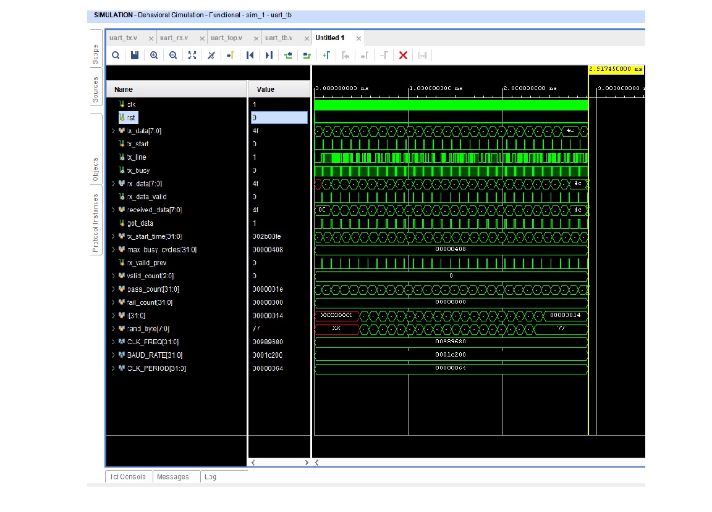

# UART Controller — Design & Verification

A synthesizable UART (Universal Asynchronous Receiver/Transmitter) controller implemented in Verilog, with a complete self-checking testbench. Designed and verified using Vivado 2025.2 behavioral simulation. No hardware required.

---

## What is UART?

UART is one of the most fundamental serial communication protocols in embedded systems. It transmits data one bit at a time over a single wire, framed with a start bit and stop bit, at a fixed baud rate agreed upon by both sides. This project implements both the transmitter (TX) and receiver (RX) sides of a full UART controller.

---

## Project Structure

```
uart_controller/
├── src/
│   ├── uart_tx.v        # UART transmitter module
│   └── uart_rx.v        # UART receiver module
├── tb/
│   └── uart_tb.v        # Self-checking testbench (loopback)
├── sim/
│   └── waveform_passing.png   # Vivado simulation waveform
└── README.md
```

---

## Design Overview

### uart_tx.v — Transmitter

Implements a 4-state FSM: `IDLE → START → DATA → STOP`

- Loads an 8-bit parallel input and serializes it onto the TX line
- Generates a precise baud rate using a clock divider counter
- Asserts `tx_busy` during transmission to prevent new data being loaded mid-frame
- TX line idles HIGH (standard UART idle state)

| Port | Direction | Description |
|------|-----------|-------------|
| `clk` | input | System clock |
| `rst` | input | Active-high synchronous reset |
| `data_in[7:0]` | input | Byte to transmit |
| `tx_start` | input | Pulse high for 1 cycle to begin TX |
| `tx` | output | Serial TX line |
| `tx_busy` | output | High while transmitting |

### uart_rx.v — Receiver

Implements a 4-state FSM: `IDLE → START → DATA → STOP`

- Detects start bit by watching for a falling edge on the RX line
- Samples each bit at the center of the bit period (half-bit offset) for maximum noise immunity
- Shifts in 8 data bits LSB-first
- Pulses `data_valid` for one clock cycle when a full byte is received

| Port | Direction | Description |
|------|-----------|-------------|
| `clk` | input | System clock |
| `rst` | input | Active-high synchronous reset |
| `rx` | input | Serial RX line |
| `data_out[7:0]` | output | Received byte |
| `data_valid` | output | Pulses high for 1 cycle when byte is ready |

### Parameters (both modules)

| Parameter | Default | Description |
|-----------|---------|-------------|
| `CLK_FREQ` | 100,000,000 | System clock frequency in Hz |
| `BAUD_RATE` | 9600 | Baud rate in bits per second |

The baud rate divider is computed as `CLK_FREQ / BAUD_RATE`, making the design fully portable to any clock frequency.

---

## Testbench — Verification Strategy

The testbench connects TX output directly to RX input (loopback), then sends three test vectors chosen to stress the design:

| Test | Byte | Why this value |
|------|------|----------------|
| 1 | `0x41` ('A') | Typical ASCII character, mixed 0s and 1s |
| 2 | `0xFF` | All ones — tests stop bit with high data |
| 3 | `0x00` | All zeros — maximum consecutive low bits, hardest timing case |

A latch-based checking mechanism captures the `data_valid` pulse correctly regardless of how short it is, then compares the received byte against the sent byte and reports PASS or FAIL.

---

## Simulation Results

Simulated in **Vivado 2025.2** — Behavioral Simulation (XSim)

```
PASS: Sent 0x41, Received 0x41
PASS: Sent 0xff, Received 0xff
PASS: Sent 0x00, Received 0x00
Results: 3 passed, 0 failed
```

Simulation settings used:
- Clock frequency: 10 MHz (scaled for faster simulation)
- Baud rate: 115,200
- Timescale: 1ns / 1ps
- Total sim time: ~277 µs

### Waveform



The waveform shows `tx_data` transitioning through `41 → FF → 00`, with `rx_data` correctly capturing each transmitted byte after the propagation delay. `pass_count` increments to 3 and `fail_count` stays at 0.

---

## How to Reproduce

### Requirements
- Vivado 2019.1 or later (tested on 2025.2)
- No FPGA board needed — simulation only

### Steps

1. Clone this repo and open Vivado
2. Create a new RTL project (any Xilinx part, e.g. `xc7a35tcpg236-1`)
3. Add `src/uart_tx.v` and `src/uart_rx.v` as Design Sources
4. Add `tb/uart_tb.v` as a Simulation Source
5. Click **Run Simulation → Run Behavioral Simulation**
6. In the Tcl Console, type:
   ```
   run -all
   ```
7. Check the Tcl Console for PASS/FAIL output

---

## Key Concepts Demonstrated

- **FSM-based serial protocol design** — clean state machine implementation for both TX and RX
- **Clock domain arithmetic** — parameterized baud rate divider works at any clock frequency
- **Center-sampling** — RX samples at mid-bit to maximize setup/hold margin
- **Self-checking testbench** — no manual waveform inspection needed; pass/fail is automated
- **Edge-case coverage** — `0xFF` and `0x00` test boundary conditions explicitly

---

## Synthesis

This design is fully synthesizable. To generate a utilization and timing report:

1. In Vivado Flow Navigator, click **Run Synthesis**
2. After synthesis completes, open **Reports → Utilization** and **Reports → Timing Summary**

Expected resource usage on Artix-7 (xc7a35t) is minimal — a few flip-flops and LUTs per module.

---
## FSM 


## License

MIT License — free to use, modify, and distribute.
